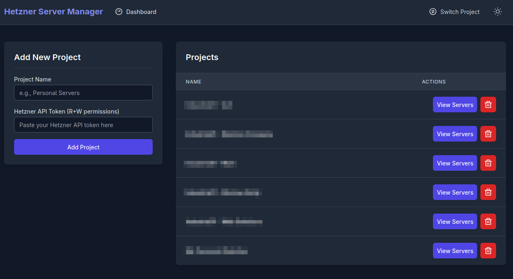
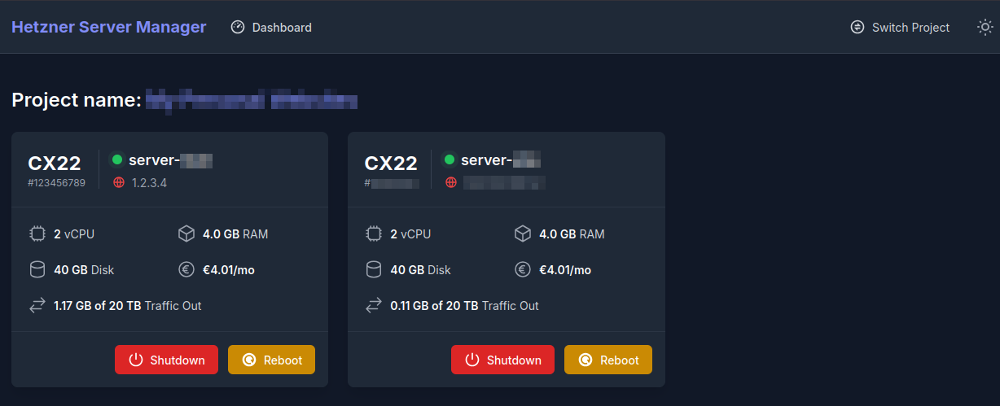
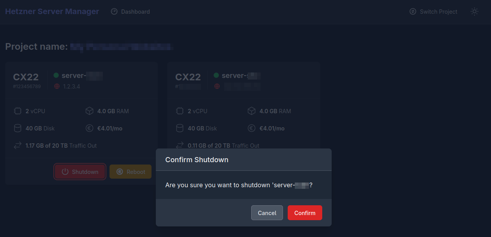

# Hetzner Server Manager 🖥️⚙️

A simple, self-hosted web application to manage multiple Hetzner Cloud servers and projects from a single, clean interface. Built with Python, Flask, and Tailwind CSS, and fully containerized with Docker. 🐳🐍

## Screenshots 📷







## Features ⭐

* **Multi-Project Management**: Securely add and manage multiple Hetzner Cloud projects. 🔐
* **Encrypted API Tokens**: API tokens are encrypted at rest in the database for enhanced security. 🔒
* **Modern Dashboard**: A responsive, card-based dashboard to monitor all your servers. 📊
* **Core Server Actions**: Power on, shutdown, and reboot servers with a single click. ⚡🔄
* **Styled Confirmation Modals**: Prevent accidental actions with sleek, non-intrusive confirmation modals. ✔️
* **Dark/Light Mode**: Theme toggler with `localStorage` persistence for user preferences. 🌙☀️
* **User-Friendly UX**: Features like copy-to-clipboard for IP addresses and real-time status indicators. 📋🟢🔴
* **Dockerized**: Easily deploy with a single command using Docker and Docker Compose. 🐳

## Tech Stack 🛠️

* **Backend**: Python, Flask, Gunicorn 🐍🔥
* **Database**: SQLite with Flask-SQLAlchemy 🗄️
* **Frontend**: Tailwind CSS, Alpine.js 🎨⚡
* **Tooling**: Node.js/npm (for asset compilation), Docker, Docker Compose 📦

---

## 🛠️ Development Setup

Use this method if you want to run the app in development mode, contribute to the project, or customize the code.

### Prerequisites 📋

* [Docker](https://docs.docker.com/get-docker/) 🐳
* [Docker Compose](https://docs.docker.com/compose/install/) (optional, for dev DB or Redis)
* Python 3.10+ 🐍
* Node.js and npm 📦

### Steps 🚀

1. **Clone the repository:**

```bash
git clone <your-repository-url>
cd hetzner-server-manager
````

2. **Create the environment file:**

```bash
cp .env.example .env
```

3. **Create and activate a Python virtual environment:**

```bash
python -m venv venv
source venv/bin/activate  # On Windows: venv\Scripts\activate
```

4. **Install Python dependencies:**

```bash
pip install -r requirements.txt
```

5. **Generate a secret encryption key:**

```bash
python -c "from cryptography.fernet import Fernet; print(Fernet.generate_key().decode())"
```

Paste the key into `.env` under `SECRET_ENCRYPTION_KEY`.

6. **Generate a secret key:**

```bash
python -c "import secrets; print(secrets.token_urlsafe(32))"
```

Paste the key into `.env` under `SECRET_KEY`.

7. **Enable Debug Mode:**

Set Debug mode to true into `.env` under `FLASK_DEBUG`.

8. **Install Node.js dependencies:**

```bash
npm install
```

9. **Initialize the database:**

```bash
flask db upgrade
```

10. **Run the application:**

Open two terminals:

* **Terminal 1:** Tailwind watcher

```bash
npm run dev
```

* **Terminal 2:** Flask development server

```bash
python ./app.py
```

11. **Access the app:**

Navigate to [http://localhost:5000](http://localhost:5000) 🌐

> The database will be created in the `data/` folder. 📂

---

## 🧪 Running Tests

To ensure your changes work as expected or to simply verify the app, you can run automated tests! ⚙️✅

### Setup

Make sure you have the development dependencies installed (including testing tools):

```bash
pip install -r requirements-dev.txt
```

### Run Tests

Use `pytest` to run all tests:

```bash
pytest
```

You should see output with passed/failed tests. Tests cover models, forms, utils, and routes.

---

## 🚀 Production Setup (Docker)

If you want to deploy the app in **production**, you can use the prebuilt Docker image with minimal configuration.

### Prerequisites 📋

* [Docker](https://docs.docker.com/get-docker/) 🐳
* [Docker Compose](https://docs.docker.com/compose/install/)

### Steps (use the pre built image) 🏗️

```text
ghcr.io/alfiosalanitri/hetzner-server-manager:latest
```

1. **Create your `.env` file:**

```bash
cp .env.example .env
```

Add your `SECRET_ENCRYPTION_KEY`, `SECRET_KEY` and `FLASK_DEBUG=false`.

2. **Create the docker-compose.yml file:** 

```bash
services:
  web:
    image: ghcr.io/alfiosalanitri/hetzner-server-manager:latest
    ports:
      - "5000:5000"
    volumes:
      - ./data/instance:/app/instance
    env_file:
      - .env
    restart: unless-stopped
```

3. **Run the container:**

```bash
docker compose up -d
```
---

### Steps (create your image) 🏗️

1. **Clone this repository:**

```bash
git clone https://github.com/alfiosalanitri/hetzner-server-manager.git
```

2. **Run the container:**

```bash
docker compose up --build -d
```
---

The app will be available at [http://localhost:5000](http://localhost:5000) 🌐

---

## 🔐 Environment Variables

The following variable is required in your `.env` file:

* `SECRET_ENCRYPTION_KEY`: Used to encrypt and decrypt Hetzner API tokens. 🔑

> ⚠️ If you lose this key, previously saved projects will become inaccessible.

* `SECRET_KEY`: Used for securely signing session cookies and other cryptographic operations.

* `FLASK_DEBUG`: Enable or disable Flask debug mode.

---

## ⚠️ Security & Access Warning

> ❗ **Warning:** This application **does not implement** any kind of authentication or login mechanism.

Anyone with access to the application's URL will be able to view and control all configured servers. **There is no user authentication or permission control.**

For this reason, **it is strongly discouraged to expose the application directly to the internet without additional protection**.
It is highly recommended to use an access control layer such as **Cloudflare Zero Trust Access**, a reverse proxy with authentication, a VPN, or another secure network gateway.

> 🔒 In production environments, securing access is essential to prevent unauthorized usage or potential harm to your infrastructure.

---

## 🤝 Contributing

Contributions are welcome! Please open an issue to suggest improvements or report bugs. Pull requests are appreciated. 🙌✨

---

## 📄 License

This project is licensed under the MIT License. See [LICENSE](LICENSE) for details. 📜
